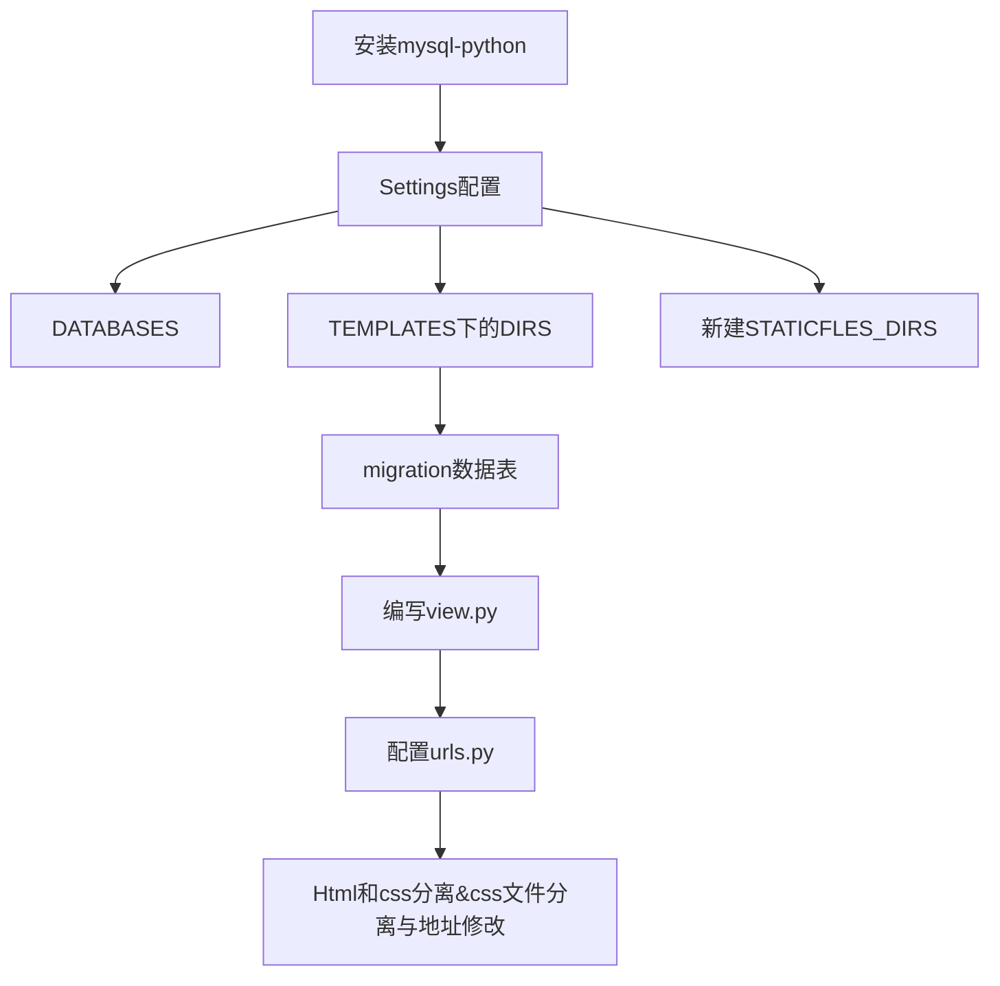

# django 教程

### 环境

pip freeze > 路径 打包环境
pip install -r 文件

包安装
| 包名                   |     作用 |
| :--------------------- | -------: |
| virtualenv             | 虚拟环境 |
| virtualenvwrapper-win  | 虚拟环境 |
| django==2.0            |     框架 |
| pymysql                |   数据库 |
| Pillow                 | 保存图片 |
| django-crispy-forms    |   xadmin |
| django-formtools       |   xadmin |
| django-import-export   |   xadmin |
| django-simple-captcha  |   xadmin |
| django-pure-pagination |   xadmin |
| future                 |   xadmin |
| httplib2               |   xadmin |
| requests               |   xadmin |


### 目录结构

- 项目名     **项目文件**
    ​    - apps    应用文件（注册）
    ​        -  admin.py 
    ​        -  apps.py
    ​        -  models.py  数据管理
    ​        -  tests.py
    ​        -  views.py
    ​    -  log       日志文件
    ​    -  media   用户上传文件
    ​    -  static     静态文件
    ​    -  extra_apps	xadmin文件
    ​    -  templactes  模板文件 html

    ​    -  项目管理文件
    ​        - settings.py  配置文件
    ​        - urls  配置入口

将apps,media, static 路径 加入全局搜索路径方法 

```python
sys.path.insert(0, os.path.join(BASE_DIR, 'apps'))
STATIC_URL = '/static/'
STATICFILES_DIRS=[os.path.join(BASE_DIR,"static")] #静态文件
MEDIA_URL = '/media/'
MEDIA_ROOT = os.path.join(BASE_DIR, 'media')
```


项目配置流程


#### 数据库配置

项目\__init__文件:

```
import pymysql
pymysql.install_as_MySQLdb()
```

setting文件

```
DATABASES = {
    'default': {
        'ENGINE': 'django.db.backends.mysql',
        'NAME': "test",
        "USER":"root",
        "PASSWORD":"",
        "HOST":"127.0.0.1"
    }
}
```
migrate
makemigrations

#### 静态文件位置
setting文件
```
STATIC_URL = '/static/'
STATICFILES_DIRS=[
    os.path.join(BASE_DIR,"static")
]
```

#### [adminx](链接：https://pan.baidu.com/s/1hl2mplR0I9WlgQPaYHqLew +ztbh )配置

setting

##### 中文与时间配置

``` python
LANGUAGE_CODE = 'zh-hans'

TIME_ZONE = 'Asia/Shanghai'

USE_I18N = True

USE_L10N = True

USE_TZ = False
```

##### 图片显示

url

```
url(r'^media/(?P<path>.*)$', serve, {"document_root": MEDIA_ROOT})] # 指定上传媒体位置]
```

##### 主题 和 logo文字配置

adminx

```python
from xadmin import  views
import xadmin
class BaseSetting(object):
    enable_themes = True
    use_bootswatch = True
xadmin.site.register(views.BaseAdminView,BaseSetting)
class GlobalSettings(object):
    site_title = u"慕学后台管理系统"
    site_footer = u"慕学在线网"
xadmin.site.register(views.CommAdminView, GlobalSettings)
```

##### 自定义配置

list_display = ["bianma","size"]#显示     

search_fields = ["size"]#查询    

list_filter = ["bianma","size"]#筛选     

ordering = ["-size"] #排序     

readonly_fields = ["size"] # 不可编辑     

exclude = ["bianma"]#隐藏     

felfield_style = "fk-ajax"# 外键搜索模式     

list_per_page = 3 #每页显示多少数据     

model_icon = "fa fa-id-card#[图标] 

list_editable=["id"]# 直接在列表直接修改 #自定义表单后出现BUG  重复输入验证

refresh_times=[2,5]# 选择刷新时间

show_detail_fields ["外键字段名"]|show_all_rel_details# 详细外键信息 BUG 需加主键名 不能筛选显示字段


- 通过外键同一页面添加信息

  ```python
  class Shopline():# 添加
      model=Shop
      extra=0
  class Shopdmin(object):# 页面
  	exclude=["bianma"]
  ```

- 一张表的不同展示

  ```python
  # model表
  class BannerCourse(Course):# 继承
      class Meta:取别名
          verbose_name = "轮播课程"
          verbose_name_plural = verbose_name
          proxy = True # 在数据库中不重复3
  # adminx
  class CourseAdmin(object):
      def queryset(self):#过滤数据
          qs = super(CourseAdmin, self).queryset()
          qs = qs.filter(is_banner=False)
          return qs
  ```

- Excel导入

```
# xadmin
import_excel=True
def post(self, request, *args, **kwargs):
    if 'excel' in request.FILES:
        pass
    return super(Goodsdmin, self).post(request, args, kwargs)
```

#### model 数据表

```
class UserMessage(models.Model):
    name=models.CharField(max_length=20,verbose_name="用户名")
    email=models.EmailField(verbose_name="邮箱")
    address=models.CharField(max_length=100,verbose_name="联系地址")
    message=models.CharField(max_length=500,verbose_name='留言信息')

    class Meta:
        verbose_name='用户留言信息'
        
```
makemigrations message（app名）
migrate message

inspectdb message_usermessage 反向生成表

##### 坑

- ID为外键

```
def __str__(self):
    return  str(self.bianma)
```


